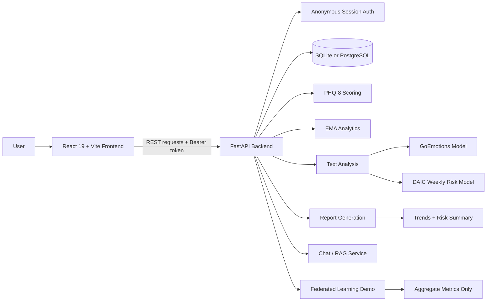

# ConfidMind

Privacy-preserving mental health monitoring for anonymous users, combining PHQ-8 screening, EMA check-ins, free-text analysis, and federated learning demos in one full-stack application.

## 1. Project Title + One-line Tagline

ConfidMind is a full-stack mental health monitoring system that helps users track mood, screening scores, and reflection trends while keeping identity data minimal.

Your Mind matters. You matter.

## 2. Overview / Problem Statement

Mental health support tools often require users to give up personal details, store sensitive data centrally, or rely on a single assessment method. That creates two problems: people may not want to use the system at all, and the system may miss useful context when it only looks at one signal.

ConfidMind addresses this by combining structured assessments such as PHQ-8, daily EMA check-ins, and free-text reflections with model-based analysis and trend reporting. It is designed for anonymous monitoring, research, and academic demonstration, where privacy, explainability, and longitudinal tracking matter.

## 3. Motivation

The project was motivated by the gap between real mental health monitoring needs and the limitations of conventional app designs. In particular, mental health data is highly sensitive, so storing names, emails, or other identifiers can create privacy concerns and reduce trust.

The system also reflects the idea that no single measure is enough on its own. A user can score moderately on a questionnaire but still show concerning weekly text patterns, or vice versa. That is why the project combines PHQ-8, EMA, text analysis, and federated learning as a privacy-focused way to explore richer mental health support.

## 4. Key Features

- Anonymous session creation with JWT-based access tokens.
- PHQ-8 assessment scoring with severity classification.
- EMA collection for daily mood and wellbeing tracking.
- Free-text reflection capture and text-based emotion/risk analysis.
- Weekly text risk assessment using a temporal LSTM aggregator.
- Longitudinal report generation with PHQ progress and EMA trends.
- Chat support backed by retrieval-augmented responses.
- Federated learning demo for privacy-aware emotion classification workflows.
- Dashboard views for progress, reports, history, and monitoring.

## 5. How It Works / Approach

ConfidMind starts by creating an anonymous session and issuing a token that is used for all protected actions. Users then submit PHQ-8 responses, EMA check-ins, and optional text reflections.

On the backend, structured data is stored in the database and analysed with scoring logic, while text is processed by ML services for emotion detection, risk estimation, and weekly aggregation. The report layer combines these outputs into trends such as recent PHQ change, EMA averages, and text-risk summaries.

The technically interesting part is the combination of short-form text analysis with temporal aggregation. Rather than treating each reflection in isolation, the weekly text-risk pipeline looks at a 7-day sequence and produces a higher-level risk classification.

## 6. Architecture / System Design



The frontend provides the user experience for assessments, progress tracking, dashboards, and reports. The FastAPI backend exposes the REST API, handles session management, and coordinates analysis services. The database stores anonymous session records and assessment history. The ML layer handles emotion classification, weekly risk scoring, and the federated learning demonstration module.

## 7. Results / Evaluation

The project is evaluated through functional workflows and report outputs rather than a single benchmark score. Core validation covers session creation, PHQ scoring, EMA submissions, text entry handling, weekly text risk generation, report generation, dashboard summaries, and the federated learning demo.

The current test plan documents 70+ functional and integration cases across authentication, PHQ, EMA, text analysis, weekly aggregation, report generation, and end-to-end flows. See [docs/test_case_planning.md](docs/test_case_planning.md) and [docs/fyp_evaluation.md](docs/fyp_evaluation.md) for the detailed evaluation matrix, validation strategy, and discussion of strengths and limitations.

## 8. Tech Stack

| Layer | Tools |
| --- | --- |
| Frontend | React 19, Vite, React Router, Chart.js, Tailwind CSS |
| Backend | FastAPI, Uvicorn, Pydantic, SQLAlchemy |
| ML / NLP | PyTorch, Hugging Face Transformers, Sentence Transformers |
| Database | SQLite for local development, PostgreSQL supported via `DATABASE_URL` |
| Auth | JWT via `python-jose` |
| Tooling | pytest, ESLint, npm |

## 9. Project Structure

```text
FYP/
├─ docs/
│  ├─ fyp_evaluation.md
│  ├─ FL_IMPLEMENTATION.md
│  ├─ weekly_text_risk_integration.md
│  └─ ...
├─ fyp-backend/
│  ├─ app/
│  │  ├─ main.py
│  │  ├─ auth.py
│  │  ├─ config.py
│  │  ├─ database.py
│  │  ├─ models.py
│  │  ├─ schemas.py
│  │  └─ routers/
│  ├─ ml/
│  │  ├─ daic.py
│  │  ├─ goemotions.py
│  │  ├─ inference/
│  │  ├─ ml_services/
│  │  └─ services/
│  ├─ scripts/
│  ├─ tests/
│  └─ requirements.txt
└─ fyp-frontend/
   ├─ src/
   │  ├─ api/
   │  ├─ components/
   │  ├─ pages/
   │  ├─ context/
   │  └─ utils/
   ├─ public/
   ├─ package.json
   └─ vite.config.js
```

## 10. Setup / Installation

### Prerequisites

- Python 3.10+.
- Node.js 18+ and npm.
- A local database, either SQLite for development or PostgreSQL if you want to mirror a deployed setup.

### Backend setup

```bash
cd fyp-backend
python -m venv .venv
.venv\Scripts\activate
pip install -r requirements.txt
```

Create a `fyp-backend/.env` file:

```env
DATABASE_URL=sqlite:///./data/app.db
SECRET_KEY=change-this-secret
ENV=development
```

Initialize the database if needed:

```bash
python app/init_db.py
```

Run the backend:

```bash
uvicorn app.main:app --reload --host 127.0.0.1 --port 8000
```

### Frontend setup

```bash
cd fyp-frontend
npm install
```

Create a `fyp-frontend/.env` file:

```env
VITE_API_BASE_URL=http://127.0.0.1:8000
```

Run the frontend:

```bash
npm run dev
```

## 11. Usage

1. Open the frontend in your browser after starting both services.
2. Create a new anonymous session from the app or via the session endpoint.
3. Complete a PHQ-8 assessment, EMA check-ins, and optional text reflections.
4. Open the dashboard or report pages to view trends, summaries, and risk outputs.

### Example API calls

Create a session:

```bash
curl -X POST http://127.0.0.1:8000/api/sessions/create
```

Check backend health:

```bash
curl http://127.0.0.1:8000/health
```

Submit a text reflection:

```bash
curl -X POST http://127.0.0.1:8000/text-entries \
  -H "Authorization: Bearer <token>" \
  -H "Content-Type: application/json" \
  -d '{"text":"I felt anxious today but managed it better than yesterday."}'
```

Request the weekly text risk report:

```bash
curl http://127.0.0.1:8000/report/weekly-text-risk \
  -H "Authorization: Bearer <token>"
```

Recommended screenshots to include in the final project write-up:

- Home page.
- PHQ assessment flow.
- EMA entry form.
- Dashboard with progress charts.
- Weekly report with text-risk summary.

## 12. Challenges & Engineering Decisions

- Privacy-first identity management was handled with anonymous sessions instead of personal accounts.
- The weekly text-risk feature required a temporal model that looks across multiple reflections rather than scoring each entry independently.
- The backend uses lazy loading for heavier ML services so the app does not pay the model cost until a prediction is actually needed.
- SQLite is kept for local development simplicity, while the codebase is structured so PostgreSQL can be used when scaling is needed.
- The federated learning module is simulated rather than distributed, which makes the workflow easier to demonstrate in an FYP setting while still showing the privacy idea clearly.

## 13. Limitations

- ConfidMind is not a diagnostic or crisis-response tool.
- Weekly text-risk analysis needs at least 3 reflections in the last 7 days to produce a meaningful result.
- The federated learning feature is a single-process simulation, not a real multi-device deployment.
- The current prototype does not include full compliance controls such as encryption-at-rest, audit logging, or clinician escalation workflows.
- Some model outputs are exploratory and should be treated as decision support rather than clinical truth.

## 14. Future Work

- Add stronger security controls such as encryption, audit logs, and rate limiting.
- Expand the federated learning demo to real distributed clients.
- Add clinician review workflows for high-risk cases.
- Validate model thresholds on a larger target population.
- Add richer longitudinal analytics and exportable charts.
- Package the project with Docker for easier deployment.
